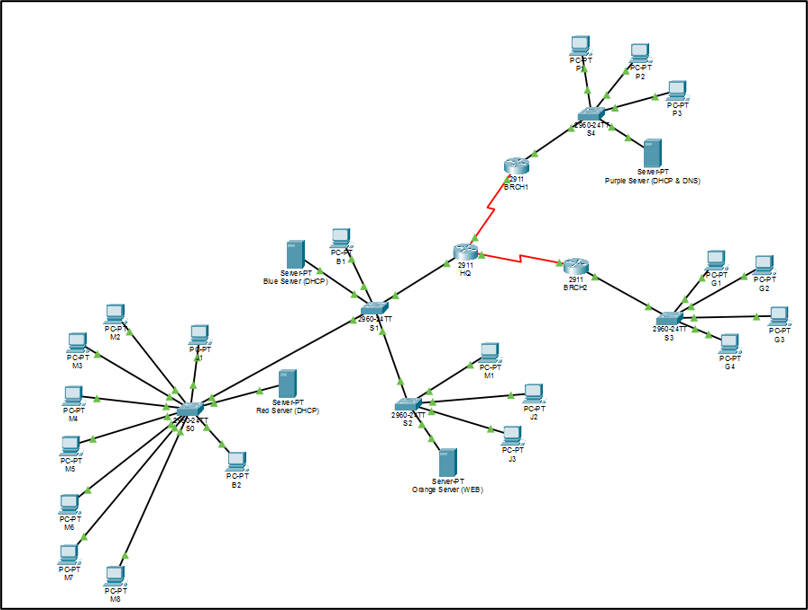
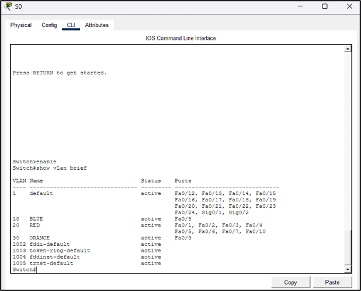
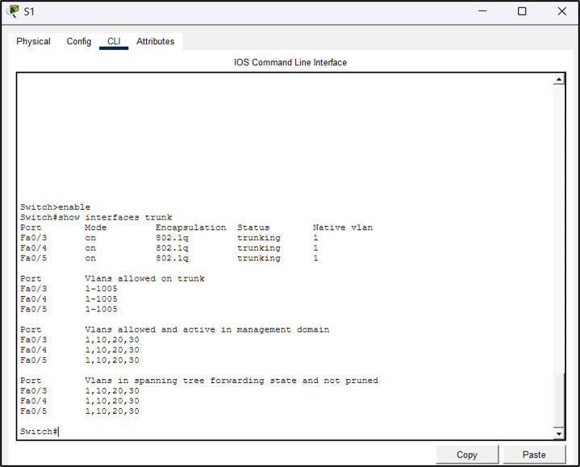
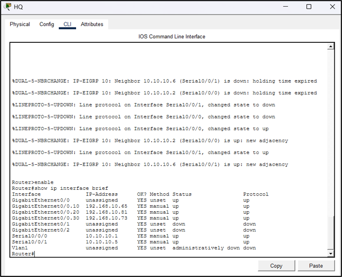
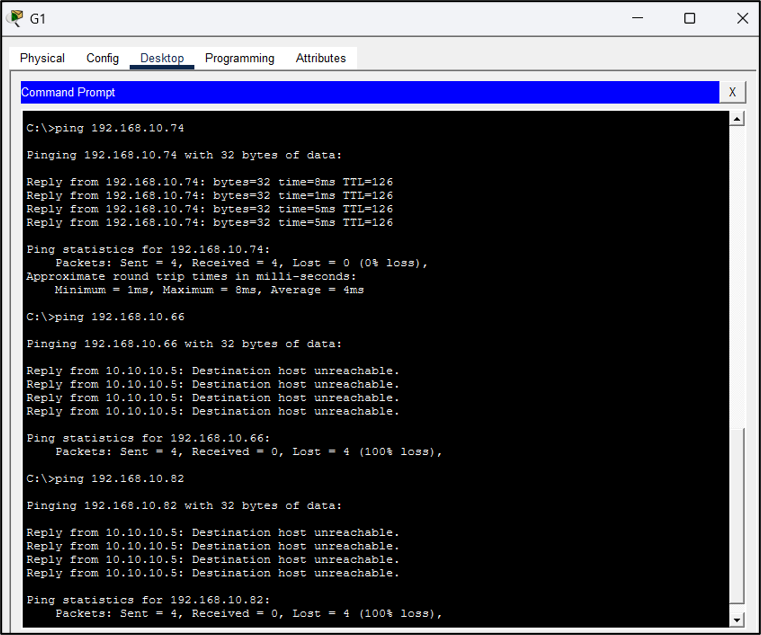
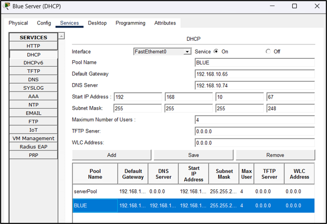
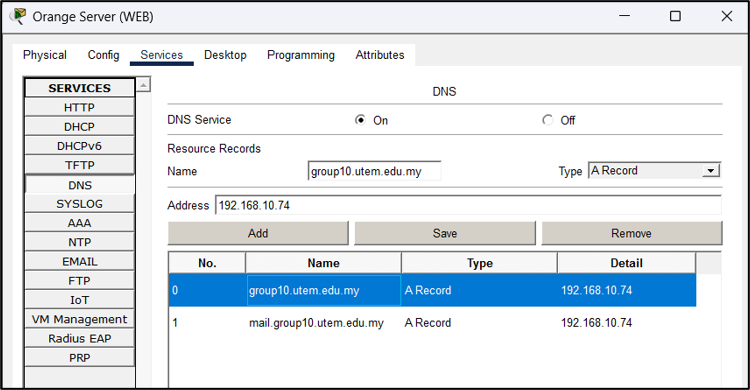
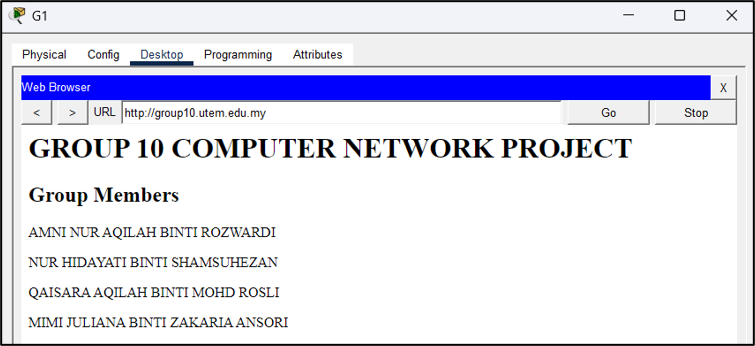

# 🌐 Enterprise Network Design using Cisco Packet Tracer

A group project developed for the **Computer Network** course at Universiti Teknikal Malaysia Melaka (UTeM). This project demonstrates the design and implementation of a complete enterprise network using Cisco Packet Tracer, integrating routing, switching, network services, and security features.

---

## 📖 Project Overview

This project simulates a small enterprise network consisting of a Headquarters (HQ) and two Branch offices interconnected through routers. The network was designed to provide secure and efficient communication by implementing VLAN segmentation, Inter-VLAN Routing, dynamic routing, DHCP, DNS, Web Server, Mail Server, and Access Control Lists (ACLs).

The objective was to build a scalable and secure network infrastructure while applying industry-standard networking concepts using Cisco Packet Tracer.

---

## 🎯 Project Objectives

- Design an enterprise network topology
- Implement efficient IP addressing using VLSM
- Configure VLAN segmentation
- Enable Inter-VLAN Routing
- Deploy dynamic routing using EIGRP
- Configure DHCP services
- Configure DNS services
- Host a web server
- Configure mail services
- Secure the network using Access Control Lists (ACLs)

---

## 🏗️ Network Topology



---

## 🛠️ Technologies Used

| Category | Technologies |
|----------|--------------|
| Simulator | Cisco Packet Tracer |
| Routing | EIGRP |
| Switching | VLAN, Trunking |
| Routing Method | Router-on-a-Stick |
| Addressing | VLSM |
| Security | Access Control Lists (ACL) |
| Network Services | DHCP, DNS, HTTP, Email |

---

## 🌐 Network Features

- VLAN Segmentation
- Inter-VLAN Routing (Router-on-a-Stick)
- Dynamic Routing using EIGRP
- Access Control Lists (ACL)
- DHCP Address Allocation
- DNS Name Resolution
- Web Server Hosting
- Email Server Configuration
- Enterprise Network Topology

---

## 📂 Project Structure

```text
packet-tracer/
    Enterprise-Network.pkt

topology/
    network-topology.png

screenshots/
    vlan.png
    trunk.png
    inter-vlan.png
    acl-test.png
    dhcp.png
    dns.png
    website.png
```

---

## 📸 Project Demonstration

### VLAN Configuration



---

### Trunk Configuration



---

### Router-on-a-Stick Configuration



---

### Access Control List (ACL) Verification



---

### DHCP Address Assignment



---

### DNS Configuration



---

### Website Access Verification



---

## 🧪 Features Successfully Tested

- ✅ VLAN communication
- ✅ Inter-VLAN Routing
- ✅ EIGRP Neighbor Formation
- ✅ Dynamic Route Advertisement
- ✅ ACL Policy Enforcement
- ✅ DHCP Address Assignment
- ✅ DNS Resolution
- ✅ Website Accessibility
- ✅ Email Communication

---

## 📚 Skills Demonstrated

- Enterprise Network Design
- Cisco IOS Configuration
- Routing & Switching
- VLAN Configuration
- Router-on-a-Stick
- Dynamic Routing (EIGRP)
- Access Control Lists
- DHCP Configuration
- DNS Configuration
- Web Server Deployment
- Network Troubleshooting

---

## 📖 What I Learned

Throughout this project, I gained hands-on experience in designing and configuring an enterprise network using Cisco Packet Tracer. I strengthened my understanding of routing and switching, network segmentation using VLANs, dynamic routing with EIGRP, network security using ACLs, and the deployment of essential network services such as DHCP, DNS, Web, and Email servers.

---

## ⚠️ Disclaimer

This repository is intended for educational and portfolio purposes only.

The project was completed as a university group assignment. This repository has been reorganized as a portfolio project. Personal information and other non-essential academic details have been omitted.

---

## 👩‍💻 Author

**Amni Aqilah**

Bachelor of Computer Science (Computer Security) with Honours

📧 Email: amniaqilah24@gmail.com

💼 LinkedIn: https://www.linkedin.com/in/amni-aqilah-b94283371/
